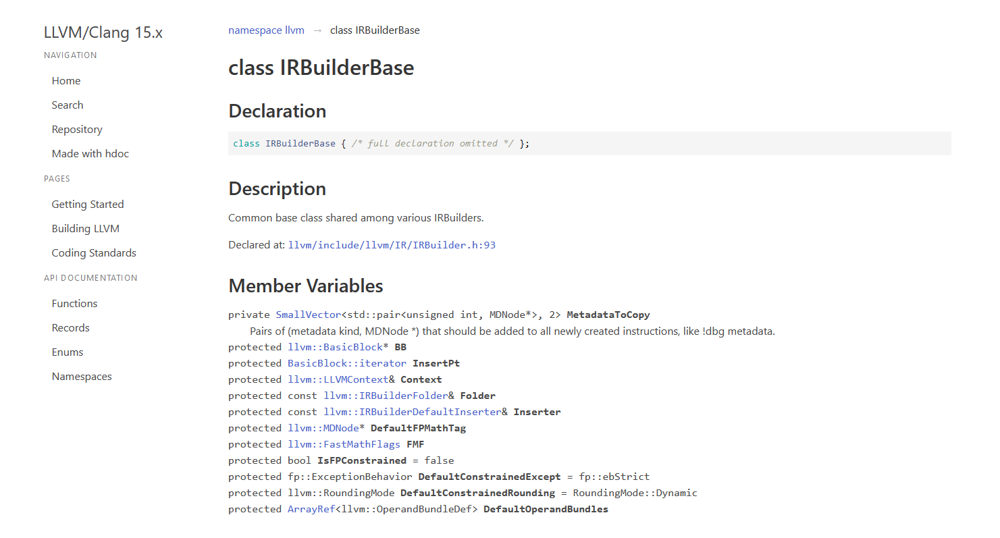
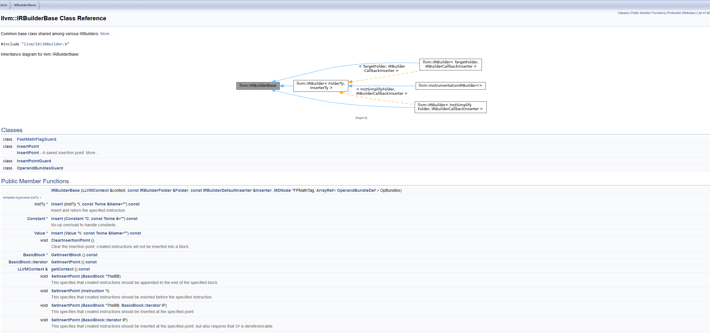
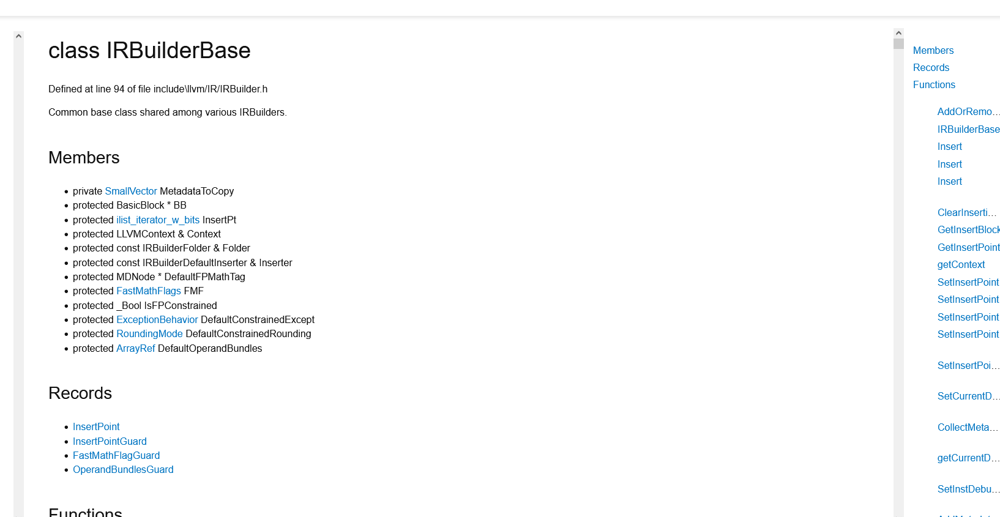

# Improve Clang-Doc Usability (GSOC 2024)

Clang doc is a documentation generation tool for the llvm project built ontop of LibTooling 

This is document is preliminary research done for GSOC proposal project improve clang doc usability
[link](https://discourse.llvm.org/t/improve-clang-doc-usability/76996)

## Comparision between clang doc and existing tools

There are alot of C++ documentation generation tools this section aims to analyze 
what each tool does well and how clang-doc can learn from them:

I will be comparing clang-doc to 
[hdoc](https://hdoc.io/), [standadese](https://github.com/standardese/standardese),
[subdoc](https://github.com/chromium/subspace/tree/main/subdoc), 
[doxygen](https://www.doxygen.nl/)

Of the comparison tools doxygen is by far the most widely used. Its features set is large and it supports multiple languages as well as multiple output formats. Getting to feature parity with doxygen will likely be out of scope for this project.

Never the less I believe clang-doc can be significantly improved to get to the point where from its baseline to make the tool more usable

# Areas for Improvement

## Improve HTML generation

Currently clang-docs html generation is quite lacking when compared to alternatives tools. 
To illustrate I will use the generation output of all of the documentation generator for the IRBuilderBase class from LLVM

The source file can be found [here](https://github.com/hdoc/llvm-project/blob/release/15.x//llvm/include/llvm/IR/IRBuilder.h)

### Hdoc Generation output ([link](./hdocIRBuilderBase.htm))

### Standarese Generation output

### Subdoc generation output

### Doxygen generation output ([link](./doxygenIRBuilder.htm))

### Clang Doc Generation Output ([link](./clangDocIRbuilderBase.htm))

## Add Support for More C/C++ constructs

# References

## Standarese Blog Post
- 