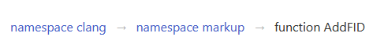
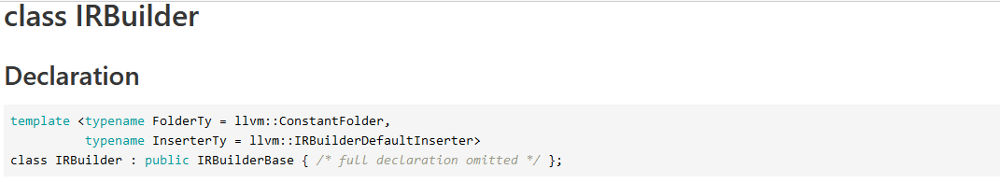

# Google Summer of Code Proposal: (Improve Clang-Doc)

## Contact Details

- email: peter.chou@mail.utoronto.ca
- github: https://github.com/PeterChou1/
- location: Toronto, Ontario Canada

## Mentors

- Petr Hosek

- Paul Kirth

## Synopsis

Clang Doc is a documentation generator for source-level documentation built within the LLVM project ontop of lib tooling. The tool directly leverages Clang AST to emit source level API information in an intermediate representation in YAML, allowing other tools to generate their own output based ontop of it. The tool currently has a lot usability issues regarding its output that make the tool difficult to use. 


## Deliverables

This section details a list of improvements that I plan to add to clang-doc, the last section also includes a proposal for a stretch goal that I think will improve Clang-Doc tremendously

### Add Markdown Support to Clang Comment Lexer and Parser

   Clang-doc relies on Clang-AST comment parser and lexer defined here and here which currently does not support markdown parsing. By extending the Clang-AST comment parser to include markdown we will able to support not 
   only clang-doc but potentially other tools leveraging Clang-AST to build a documentation generator.

   Here are the initial markdown structures I plan to add to the clang-ast

   - Headers
      ```md
      #HEADER

      or

      HEADER
      ======
      ```
   - Block Quotes
     
      ```md
      > Block Quote Line 1
      > Block Quote Line 2
      ```

   - List

      ```md
      - List Item 1
        + Nested List Item Should Also be supported
      - List Item 2
      ```

   - Fenced Code blocks 
      ```md

      ~~~json
        {
          "firstName": "John",
          "lastName": "Smith",
          "age": 25
        }
      ~~~

      ```
   - Links

      ```md
      [test](https://test.com)
      ```

   - Images
      ```md
      
      ```

   - Tables

      ```md
      First Header  | Second Header
      ------------- | -------------
      Content Cell  | Content Cell
      Content Cell  | Content Cell
      ```


### Add Support for more C++ constructs

- C++ include support for attributes
  
  Attributes were introduced C++11 as a way to specify additional metadata to a program construct for C++.
  Not all attributes are needed to be supported for clang-doc but I think the **[[deprecated("Reason")]]** and **[[deprecated]]** should be supported since this would be revelant to a programmer scrolling through documentation


- Macro Documentation Support

  Current clang-doc doesn't parse macros at all. This problem might be harder than it looks since apparently clang doesn't parse macros very well see issue [here](https://discourse.llvm.org/t/closing-the-gap-between-the-preprocessor-and-the-ast/6254). 
  
  However if we look at subdoc it seems like they are able to parse and generate macro documents just fine, and from the looks of the codebase it looks like subdoc is also leveraging the clang AST to parse C++. So we can look at subdoc as a nice reference point for including macro doc support.


- C++ concept support

  Concepts are a C++20 language construct that represent a constraint on templated arguments. Clang-Doc
  has no support for it. Although since we're focus on adding C++17 support this might be a stretch goal for the project


### Add support for new commands

  Doxygen provides a set of special commands defined [here](https://www.doxygen.nl/manual/commands.html). 
  There are a total of over 437 commands supported, currently
  clang-ast/clang-doc understands the commands. 

  ```
  \tparam
  \param
  \verbatim
  \endverbatim
  ```
  
  Since it would impractical to implement all 437 commands, I've parsed through the LLVM codebase and determined the following commands are the most important that should be added.

  ```
  \see
  \sa
  \note
  \pre
  \code{.cpp}
  \endcode
  \defgroup
  ```

  Note: everything except for \code is already parsed pretty well by the clang AST and 
  is already exported by the yaml output, however these commands are supported very poorly 
  by the markdown and html output. 

  - See and See Also (**\see** and **\sa**)

    The **\see** and **\sa** command starts a paragraph that cross references to a class
    function, methods, variables, files or URL. The LLVM codebase has a large number of
    these commands which point to all areas of the code base

    Doxygen would automatically parse certain function or class symbols and link them to each
    other. The details of how that work is described [here](https://www.doxygen.nl/manual/autolink.html)

    Clang-Doc should implement something similar to allow users to automatically link to other parts of the
    code

  - Note and Precondition (**\note** and **\pre**)

    **\note** note command marks an important note that a developer should know

    **\pre**  describes a precondition associated with function
  
  - Code (**\code** and **\endcode**)

    This is used a lot in the LLVM code base to illustrate small snippets of example code. Clang-AST doesn't
    parse this well at all. 

  - Defgroup (**\defgroup**)

    Defgroup is doxygen command that groups related doxygen functions/methods/classes/etc under one Topic
    it is used extensively in the clang-c codebase to group related C++ constructs together. 

    The clang-AST doesn't even bother parsing any comments that's not attached to a c++ declaration so this would
    also require changing how the AST parses comments.

    I'm not really a fan of how doxygen implemented this concept, in my opinion it pollutes the code too much with doxygen artifacts that make it look weird, If I am going to implement this I would much rather go with how standardese implemented it. By introducing a \module command that would group related functionality together

### Improve HTML output

   The current HTML output for Clang-Doc looks like this

   

   Here are a list of improvements I plan on adding to the HTML output

   1. Leverage Clang-AST markdown to render Markdown output
    
      Once Clang-AST is extended for markdown we
      can then leverage that render it to an HTML output

   2. Add namespace navigation to the top of the HTML output

      virtually all other doc generators I've seen has namespace navigation for whatever class we should something similar to clang-doc
      
      here is ideally something we can implement

      

   3. Reorganize output formats section

      Clang-Doc currently organize the layout of class documentation as

      - Members
      - Records (I think this should be rename to classes to be honest)
      - Functions

      There is no distinction between the visibility scope of the methods/members and whether or not they are static that is why I'm proposing to split the HTML output to the following sections

      - public members
      - protected members
      - private members (Not visible by default)
      - static members
      - public methods
      - protected methods
      - private methods (Not visible by default)
      - static methods
      - constructor/destructors
      - typedefs
      - enums

   4. Group overloaded methods into a single dropdown

      Overloaded methods should not be seperated into their own entries
      instead only one method they should all group into a drop down entry in html

   5. Remove private methods and members from the output

   6. Include inherited Members and Methods in a dropdown
     
      This is something that doxygen currently does although I'm not really if it is really helpful

   7. Include more information in Declaration

      In subdoc, hdoc and doxygen class declaration contains the full C++ declarations like so

      

      This in contrast to current html output of clang-doc which doesn't contain as much information (as shown above). Clang Doc should have more information in declarations generated not just for classes but also for methods, and functions

   8. Refactor css for a more appealing modern look 


### Experimental Stretch Goal - Add a templating library

  This is an experimental idea that we could pursue upon the completion of all other of the above task.
  
  **Motivation**

  The current offering of C++ documentation generators gives developers control of the output through special
  documentation commands embedded directly in source file or through initialization files. 

  The problem is special commands that control the output of the look such as **\p** or **\b** in doxygen is that it directly pollutes the documentation making it less readable to the developer reading comments from source. And sometimes special documentation commands can produce unexpected results or may not even be fine grain or specific enough for the developer.

  On the other hand ini files often don't give fine if control of the documentation output no matter how much
  configuration options are added.

  In theory a motivated developer could write a custom backend for doxygen or even clang-doc to get the documentation to generate exactly as he or she wishes to. But that requires getting familiar with another
  code base API to which takes a lot of time.

  Instead of labouriously writing a new backend or writing large amounts of special commands try to fix up a documentation output. I'm proposing a brand new way to output documentation for C++ by leveraging a templating
  langauge for generating C++ documentation.


  **implementation**

  Similar to existing html templating libraries clang-doc templating would expose a couple of underlying language construct available for developer to use in their template langauge.

  Take for example the following class
  ```cpp
  /**
  * @brief This class is used for demonstration purposes in Doxygen documentation.
  */
  class Test {
  public:
      /**
      * @brief Typedef for a custom complex number type within Test class.
      */
      typedef std::pair<float, float> ComplexNumber;

      /**
      * @brief Enum to demonstrate documentation of enumerations within the Test class.
      */
      enum class Status {
          OK,       ///< Represents a successful status.
          ERROR,    ///< Represents an error status.
          UNKNOWN   ///< Represents an unknown status.
      };

      /**
      * @brief Constructor for the Test class.
      */
      Test();

      /**
      * @brief Destructor for the Test class.
      */
      ~Test();

      /**
      * @brief Simple method to demonstrate documentation.
      *
      * @return void
      */
      void simpleMethod();

      /**
      * @brief Calculates the sum of two integers.
      *
      * @param a First integer.
      * @param b Second integer.
      * @return int The sum of a and b.
      */
      int add(int a, int b);

      /**
      * @brief Checks if a number is even.
      *
      * @param number The number to check.
      * @return true If the number is even.
      * @return false If the number is odd.
      */
      bool isEven(int number);

      /**
      * @brief Gets the name of the Test.
      *
      * @return std::string The current name.
      */
      std::string getName() const;

      /**
      * @brief Sets the name of the Test.
      *
      * @param name The new name.
      * @return void
      */
      void setName(const std::string &name);

      /**
      * @brief Demonstrates a method that throws an exception.
      *
      * @throws std::runtime_error When an error condition occurs.
      * @return void
      */
      void errorProneMethod();

      /**
      * @brief Multiplies two numbers.
      *
      * @param x First number.
      * @param y Second number.
      * @return double The product of x and y.
      */
      double multiply(double x, double y);

      /**
      * @brief Demonstrates a method with a default parameter.
      *
      * @param value The value to process.
      * @param factor Multiplication factor (default is 2).
      * @return int The processed value.
      */
      int processValue(int value, int factor = 2);

      /**
      * @brief A static utility method.
      *
      * @param data Data to process.
      * @return int Processed data.
      */
      static int utilityMethod(int data);

      /**
      * @brief Demonstrates usage of a template method.
      *
      * @tparam T The type parameter.
      * @param param Parameter of type T.
      * @return T The processed parameter.
      */
      template <typename T>
      T templateMethod(T param);

      /**
      * @brief Demonstrates usage of the ComplexNumber typedef.
      *
      * @param number A complex number.
      * @return ComplexNumber The processed complex number.
      */
      ComplexNumber complexOperation(ComplexNumber number);

      /**
      * @brief Retrieves the current status.
      *
      * @return Status The current status of the Test object.
      */
      Status getStatus() const;

  private:
      std::string name; ///< Name of the test object.
      Status status;    ///< Current status of the test object.
  };

  ```

  The developer would feed the following class template file to Clang-Doc to generate their own markdown 
  formatted documentation

  Note: this is an imaginary language used for illustrative purposes

  ex. template-class.template
  ```
  Example Clang Doc Template
  ---

  # {{class.name}}
  {{class.comments.brief}}

  {{ for method in class }}

  ## {{method.name}} - {{method.signature}}
    {{if method.name == 'isEven'}}
  Add some custom doc for method isEven
  {{method.comments.brief}}
    {{else}}
  {{method.comments.brief}}
    {{endif}}
  return value: {{method.comments.return}}

  ### Parameters
    {{ for param in method.comments.params }}
  Parameter: {{param}}  
    {{endif}}
  {{endif}}
  ```

  and the output would look like

  ```md
  Example Clang Doc Template
  --- 

  # Test
  This class is used for demonstration purposes in Doxygen documentation.

  ## simpleMethod - void simpleMethod()
  Performs a simple operation without any parameters or return.

  ## add - int add(int a, int b)
  Calculates the sum of two integers.
  return value: The sum of a and b.

  ### Parameters
  Parameter: a  
  Parameter: b  

  ## isEven - bool isEven(int number)
  Checks if a number is even.
  Add some custom doc for method isEven
  return value: true if the number is even, false otherwise.

  ### Parameters
  Parameter: number  

  ## getName - std::string getName() const
  Gets the current name of the Test instance.
  return value: The current name.

  ## setName - void setName(const std::string &name)
  Sets a new name for the Test instance.
  return value: void

  ### Parameters
  Parameter: name  

  ## multiply - double multiply(double x, double y)
  Multiplies two numbers.
  return value: The product of x and y.

  ### Parameters
  Parameter: x  
  Parameter: y  

  <...Continue with the rest of the methods similarly...>
  ```


  The benefit of this approach is that it would give the end user unparralled flexibility in controlling the output of the outputed documentation. This method of generation would not only work for markdown but
  could be conceivably extended to support any text based documentation format including

  - rst files
  - latex files
  - html output
  - [mdx](https://mdxjs.com/) files

## Proposed Timeline

- May 4-28, Community Bonding:

  Open an issue for clang-AST in the LLVM repository to discuss changes in adding markdown support.
  iron down any details and concerns for all stakeholders involved.

  Work on familiarizing myself with the Clang-AST code base.

- May 29, Coding officially begins!

  Work on implementing the first set of markdown changes for clang-AST
  implement support for 
  - headers
  - lists
  - block quotes

- Weeks 2-3:

  Continue to work on the next set of markdown changes for clang AST
  implement support for
  - Fenced Code blocks
  - Table
  - Images
  - Links

- Week 4-6:

  - Work with mentors to improve css layout of clang-doc html output
  - Fix bugs related to markdown output
  - Implement markdown rendering for HTML output

- Week 7:

  - Work on improving HTML output
    - Rework how class output is organized
    - Group overloaded functions
    - Add inherited members
    - Add more

- Week 8:

  - Work on automatic link generation similar to how doxygen handles it
  - Add support for more doxygen commands namely **\see \sa \code \note \pre**
    in the HTML and markdown output

- Week 9-10:

  Explore the stretch goals and try to implement them.

- Week 11:

  Reserved as a buffer week to complete any unfinished tasks and final touch-ups.


- August 21, Week 12 Final week:

  Review any final comments and suggestions to the project codebase and work on writing the final report for the GSoC project.


## Good Fit

I am an aspiring Compiler Developer that just graduated from the University of Toronto in Computer Science. I'm very new to compiler development but I'm an experienced web developer.

My compiler experience consist of a compiler optimization classes I took in university about LLVM. In that class I mostly dealt with the LLVM middle end, where we re-implemented common optimization passes such as Common Subexpression Evaluation, Lazy Invariant Code Motion, etc.

I have an extensive web background, I've interned at over 3 different companies working in full capacity as fullstack web developer, I've also TA for my universities intro to web programming course.

### Past LLVM Contributions

I am relatively new to LLVM but I want to get involved! I've but so far I've only contributed to one patches 
and one ongoing pull request

- minor doc change (merged) - https://github.com/llvm/llvm-project/pull/83415
- instcombine (under-review) - https://github.com/llvm/llvm-project/pull/84619 


