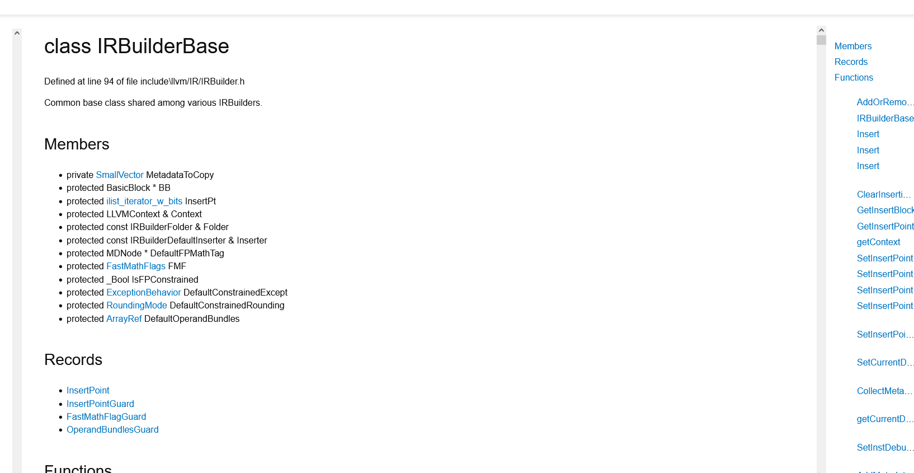

# Improve Clang-Doc Usability (GSOC 2024)

Clang doc is a documentation generation tool for the llvm project built ontop of LibTooling 

This is document is preliminary research to explore avenues to improve [clang-doc](https://clang.llvm.org/extra/clang-doc.html) for GSOC proposal project improve clang doc usability
[link](https://discourse.llvm.org/t/improve-clang-doc-usability/76996)


## Comparision between clang doc and existing tools

There are alot of C++ documentation generation tools this section aims to analyze 
what each tool does well and how clang-doc can learn from them.

I will be comparing clang-doc to 
[hdoc](https://hdoc.io/), [standadese](https://github.com/standardese/standardese),
[subdoc](https://github.com/chromium/subspace/tree/main/subdoc), 
[doxygen](https://www.doxygen.nl/)

Of the comparison tools doxygen is by far the most widely used. Its features set is large and it supports multiple languages as well as multiple output formats. Getting to feature parity with doxygen will likely be out of scope for this project.

Never the less I believe clang-doc can be significantly improved to get to the point the tool is significantly more usable

For reference I will use the generation output of all of the documentation generator for the IRBuilderBase class from LLVM.
The IRBuilderBase class is defined in the source file found [here](https://github.com/hdoc/llvm-project/blob/release/15.x//llvm/include/llvm/IR/IRBuilder.h)

Its worth noting that Standardese and Subdoc were designed with their owned documentation syntax in mind so their generated
output will look bad compared to if the source code were written with their syntax in mind


### Hdoc Generation output ([link](./hdocIRBuilderBase.htm))


This screen shot was taken directly from the hdoc website LLVM is the demo project the website uses to show off the capability of hdoc you can see more [here](https://hdoc.io/docs/features/api-docs/)

#### Comments

Hdoc was built with interopability with Doxygen in mind so it supports a small subset of doxygen commands which includes
(Note: it doesn't matter if the user specifies between @ or /)
```
@brief 
@param
@returns
@tparam
```

I like the overall design of the documentation although I think a good

#### What clang-doc can learn from Hdoc

Hdoc features an out of the box search functionality that doxygen doesn't have I believe hdoc would provide a nice reference implementation for the search functionality for html output of clang-doc


### Standardese Generation output ([link](./standardeseScreenshot.PNG))


#### Comments

The standardese output is quite spartan it is devoid of any css. Although generating doc from LLVM source code
is not really fair to the full capabilities of the tool. For a project that's was written with standardese in mind you can consult
[here](https://type_safe.foonathan.net/) 

The standardese project also appears to be largely abandoned with the last commit being a year ago with the author filing a post-mortem thoughts on the project [here](https://www.foonathan.net/2019/11/standardese-post-mortem/)

Some interesting capabilities of standardese
- comments can be formatted using a markdown flavor called commonmark with the ability to link to different parts of the code
- groups or related code can be group by using the \module command
- ability to exclude certain files from appearing in the doc by using \exclude command
- ability to specify custom sections in the documentation for example
- ability to rename a class to something else throught the \unique_name 

```
/// Some int getter.
/// \output_section Getter functions
int get_i();

/// Some float getter.
float get_f();

/// Some int setter.
/// \output_section Setter functions
void set_i(int val);

/// Some float setter.
void set_f(float f);

```

will output
```
//=== Getter functions ===//
int get_i();

float get_f();

//=== Setter functions ===//
void set_i(int val);

void set_f(float f);
```

#### What clang-doc can learn from Standardese

I find the ability to the programmer a set of directives to directly control the output of generation interesting. It could be interesting to explore directives that directly controls the meta aspects of documentation generation. 

I like the ability to physicsally group related functions and class using the \modules directive to my knowledge I don't think doxygen has that feature

### Subdoc generation output 

- TODO: to be added


### Doxygen generation output ([link](https://llvm.org/doxygen/classllvm_1_1IRBuilderBase.html))


#### Comments

The doxygen output for llvm is by the most feature complete out of the surveyed doc generators. It features almost all features discussed from the previous generators. And it includes a nifty diagram to illustrate what classes depend on the current one, this is something I've not seen from any c++ generators (Although I'm not sure how helpful it is when reading documentation).


#### What clang-doc can learn from Doxygen

Doxygen supports alot of features I think the overall generated doc looks a bit dated but that is more to do with css than the contents of the file

Here are some things I like about doxygen that clang-doc could benefit from

- Doxygen has really great navigability also all defined paramaters for class are hyperlinked to each other so If you want know what is the Value type from the method Insert you can just click on it

- The inheritance diagram on display is really impressive

- Doxygen also includes inherited class members under


### Clang Doc Generation Output ([link](./clangDocIRbuilderBase.htm))



#### Comments

The css for the output html is not really great. The scroll bars are awkwardly placed. And the private members are exposed in the documentation which I think by default should not happen unless specified otherwise by a developer. 

The navigation bar is to the left which I don't think looks very nice. I think it should located on the right but that is a matter of personal taste.


# Areas for Improvement

## Proposal 0: Add Support for More C/C++ constructs when parsing

Not all C++ constructs are supported in clang-doc.

From my brief review of the clang doc source code it seems the current tool supports

- Records (structs)
- Function
- Typedef
- Enum
- Namespaces

I think all the code that clang-doc is aware is defined [here](https://github.com/llvm/llvm-project/blob/main/clang-tools-extra/clang-doc/Representation.h)

I am not too familiar with the clang-doc codebase so maybe one of the mentors can corrent me if I am wrong. Additionally I would like more inputs from one of the mentors on what c++ constructs would be nice to add to clang-doc.


## Proposal 1: Improve HTML generation

Currently clang-docs html generation is quite lacking when compared to the alternatives tools.
To that end there are several steps I think there are several steps we can take to 
incrementally improve the html output of the tool


### Step 0: Add support /param in HTML output

The markdown output for clang-doc supports /param but not in the html output

### Step 1: Add namespace navigation

hdoc and doxygen both support namespace navigation, at the top of the page I think this would improved the navigability of the output html.

### Step 2: Add search support

Doxygen supports search but it doesn't work out of the box. As a result the LLVM auto generated docs does not
have a search bar I think this could be one of the advantages for encouraging the switch to clang-docs. Hdoc has a nice search functionality so it we have a nice reference implementation to consult when implementing this feature

### Step 3: Remove private members from documentation

I think unless explicitly specified by the programmer that private functions should be excluded in the outputed documentation. This is a problem with markdown output as well 

### Step 3: Refactor css code to make the generated output look nicer

I think the current css output right now is barely servicable it can be significantly improved to look easier on the eyes. This might be something would require the input of the mentor and community to make look better.

I have experience working with figma mockups I could present a few mockups for further feedback.

## Proposal 2: Add markdown support in comments

In original [RFC](https://discourse.llvm.org/t/rfc-clang-doc-proposal/47035/3) for clang-doc, it was mentioned that markdown style comment would be a useful future extension to my knowledge this is still not supported.

I suspect this would require a significant amount of effort to write a markdown parser but it could be an interesting project

## Proposal 3: Improve clang-doc preformance

When I generated run clang-doc on the full llvm source code with compile_commands.json my computer hangs and freezes I'm not sure what is happening 
(Needs more investigation)

## Proposal 4: Add Diagram support

Doxygen has diagram visualization it would be interesting to see if clang doc could generate something similiar. I suspect this will require a huge amount of work to add this though 

